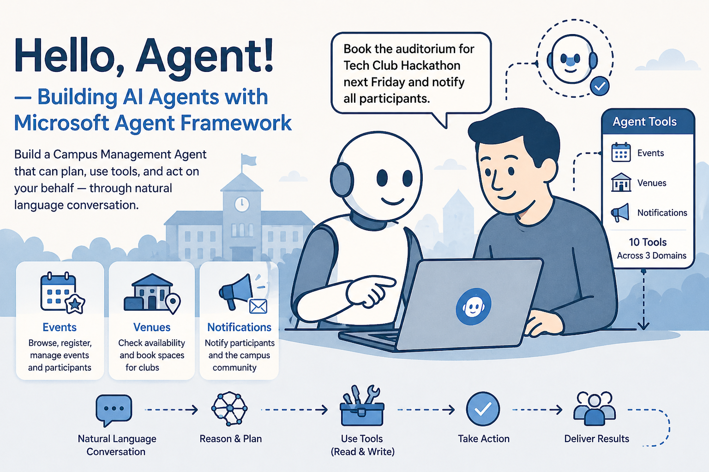

# Hello, Agent! — Building AI Agents with Microsoft Agent Framework

A hands-on workshop on building AI agents from scratch using [**Microsoft Agent Framework**](https://learn.microsoft.com/en-us/agent-framework/overview/?pivots=programming-language-python), delivered at the Agentic AI Seminar, Gurunanak College, Hyderabad.



## Overview

This workshop takes you beyond simple chat interfaces and into the world of **agentic AI** — systems that can reason, use tools, and act on your behalf.

Using a campus management system as the hands-on use case, you'll build a fully-functional AI agent capable of managing events, booking venues, and sending notifications — all through natural language conversation.

## Workshop Structure

### Lab 0: Environment Setup

- Install Microsoft Agent Framework
- Configure GitHub Models for free LLM access (GPT-4o-mini)
- Deploy the mock campus backend API via ngrok
- Verify the end-to-end setup

### Lab 1: Building the Agent

Build a **Campus Management Agent** with 10 tools across 3 domains:

- **Events** — browse events, get details, register students, view participants, unregister
- **Venues** — list venues, check availability, book spaces for clubs
- **Notifications** — notify event participants and the broader campus community

**Key concepts:**

- Designing tool functions with type hints and docstrings
- Auto-generating tool schemas from Python functions
- Creating agents with Microsoft Agent Framework
- Writing effective system-prompt instructions
- Multi-turn conversations with session management
- Mixing READ and WRITE operations safely

## Project Structure

```text
├── backend/
│   └── mock_backend.py            # FastAPI mock backend (events, venues, notifications)
├── labs/
│   ├── Lab0_Setup.ipynb           # Environment setup
│   ├── Lab1_Building_Agent.ipynb  # Agent development (main lab)
│   └── utils.py                   # Helper functions (schema generation, response printing)
└── README.md
```

## Prerequisites

- Python 3.8+
- GitHub account (for GitHub Models free tier)
- ngrok account (for exposing the local backend)
- Google Colab (recommended) or local Jupyter environment

## Quick Start

1. **Clone the repository**

   ```bash
   git clone https://github.com/tezansahu/building-eval-driven-ai-agents.git
   cd building-eval-driven-ai-agents
   ```

2. **Open Lab 0 in Google Colab** and follow the setup instructions

3. **Work through Lab 1** to build your campus management agent

## Key Technologies

- **[Microsoft Agent Framework](https://github.com/microsoft/agent-framework)** - High-level agent orchestration
- **[GitHub Models](https://github.com/marketplace/models)** - Free LLM access (GPT-4o-mini)
- **FastAPI** - Mock campus backend API
- **ngrok** - Public URL for the local backend

## Learning Outcomes

After completing this workshop, you will:

- ✅ Understand what makes an AI agent different from a chatbot
- ✅ Design tool functions with proper type hints and docstrings
- ✅ Auto-generate tool schemas from Python functions
- ✅ Build agents with multiple tools spanning GET and POST operations
- ✅ Write effective system-prompt instructions
- ✅ Manage multi-turn conversations using sessions
- ✅ Test and debug agent behaviour interactively

## License

MIT

## Author

**Tezan Sahu** — Workshop materials developed for the Agentic AI Seminar, Gurunanur College, Hyderabad

## Workshop

"Hello, Agent! — Building AI Agents with Microsoft Agent Framework"
